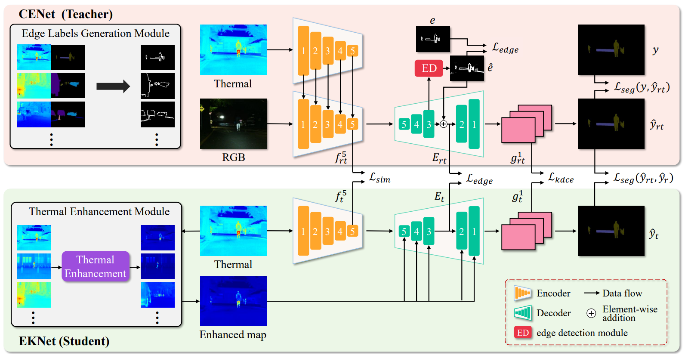
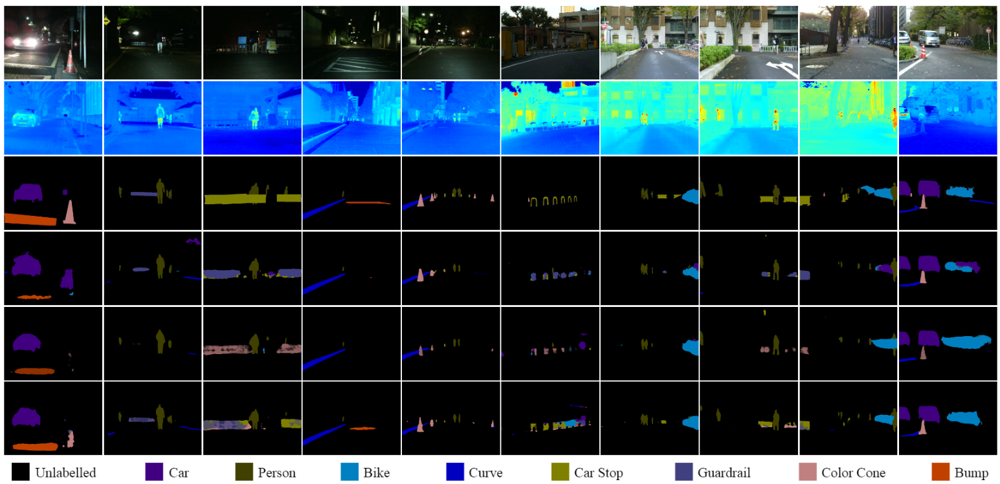

# CEKD-PyTorch
The official pytorch implementation of **CEKD: Cross-modal Edge-privileged Knowledge Distillation for Semantic Scene Understanding using Only Thermal Images**. ([RA-L](https://ieeexplore.ieee.org/document/10049523)). 

We test our code in Python 3.7, CUDA 11.1, cuDNN 8, and PyTorch 1.7.1. We provide `Dockerfile` to build the docker image we used. You can modify the `Dockerfile` as you want.  
<div align=center>

</div>

# Demo

The accompanied video can be found at: 
<div align=center>
<a href="https://www.youtube.com/watch?v=dd3zEopVEhA">
</div>

# Introduction
CEKD is a knowledge distillation framework, which includes a teacher netwrok CENet and a student network EKNet. CENet is a multi-modal fusion network for semantic segmentation of urban scenes. EKNet is a thermal-only network for semantic segmentation of urban scenes.
# Dataset
The original dataset can be downloaded from the MFNet project [page](https://www.mi.t.u-tokyo.ac.jp/static/projects/mil_multispectral/). You can use the [ELG](https://github.com/Lavender105/DFF/tree/master/lib/matlab) module to generate the edge map for training. You can also download our processed data from [here](https://labsun-me.polyu.edu.hk/zfeng/CEKD/).
# Pretrained weights
The pretrained weight of CEKD can be downloaded from [here](https://labsun-me.polyu.edu.hk/zfeng/CEKD/).
# Usage
* Clone this repo
```
$ git clone https://github.com/lab-sun/CEKD.git
```
* Build docker image
```
$ cd ~/CEKD
$ docker build -t docker_image_cekd .
```
* Download the dataset
```
$ (You should be in the CEKD folder)
$ mkdir ./dataset
$ cd ./dataset
$ (download our preprocessed dataset.zip in this folder)
$ unzip -d . dataset.zip
```
* To reproduce our results, you need to download our pretrained weights.
```
$ (You should be in the CEKD folder)
$ mkdir ./weights_backup
$ cd ./weights_backup
$ (download our preprocessed weights.zip in this folder)
$ unzip -d . weights.zip
$ docker run -it --shm-size 8G -p 1234:6006 --name docker_container_cekd --gpus all -v ~/CEKD:/workspace docker_image_cekd
$ (currently, you should be in the docker)
$ cd /workspace
$ (To reproduce the results of thermal student network EKNet)
$ python3 run_demo_student.py   
$ (To reproduce the results of RGB-thermal teacher network CENet)
$ python3 run_demo_teacher.py   
```
The results will be saved in the `./runs` folder.
* To train CEKD (teacher network CENet and student network EKNet)
```
$ (You should be in the CEKD folder)
$ docker run -it --shm-size 8G -p 1234:6006 --name docker_container_cekd --gpus all -v ~/CEKD:/workspace docker_image_cekd
$ (currently, you should be in the docker)
$ cd /workspace
$ (To train our RGB-thermal teacher network CENet)
$ python3 trainTeacher.py
$ (To train our thermal student network EKNet)
$ python3 trainStudent.py
```
* To see the training process
```
$ (fire up another terminal)
$ docker exec -it docker_container_cekd /bin/bash
$ cd /workspace
$ tensorboard --bind_all --logdir=./runs/tensorboard_log/
$ (fire up your favorite browser with http://localhost:1234, you will see the tensorboard)
```
The results will be saved in the `./runs` folder.
Note: Please change the smoothing factor in the Tensorboard webpage to `0.999`, otherwise, you may not find the patterns from the noisy plots. If you have the error `docker: Error response from daemon: could not select device driver`, please first install [NVIDIA Container Toolkit](https://docs.nvidia.com/datacenter/cloud-native/container-toolkit/install-guide.html) on your computer!

# Citation
If you use CEKD in your academic work, please cite:
```
@ARTICLE{10049523,
  author={Feng, Zhen and Guo, Yanning and Sun, Yuxiang},
  journal={IEEE Robotics and Automation Letters}, 
  title={CEKD: Cross-modal Edge-privileged Knowledge Distillation for Semantic Scene Understanding using Only Thermal Images}, 
  year={2023},
  volume={},
  number={},
  pages={1-8},
  doi={10.1109/LRA.2023.3247175}}
```

# Acknowledgement
Some of the codes are borrowed from [RTFNet](https://github.com/yuxiangsun/RTFNet), [PiDiNet](https://github.com/aja32/Pixel_Difference_Net) and [ESPNet](https://github.com/irfanICMLL/structure_knowledge_distillation)

Contact: yx.sun@polyu.edu.hk

Website: https://yuxiangsun.github.io/
